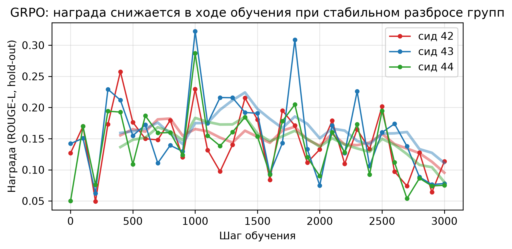
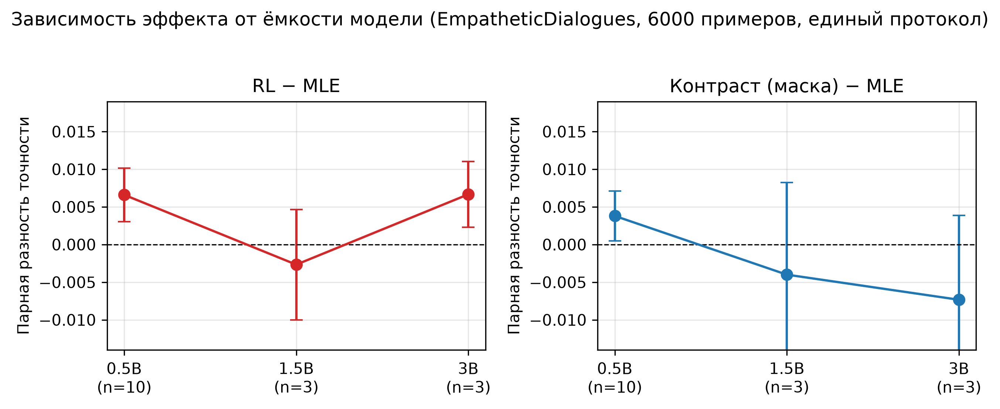
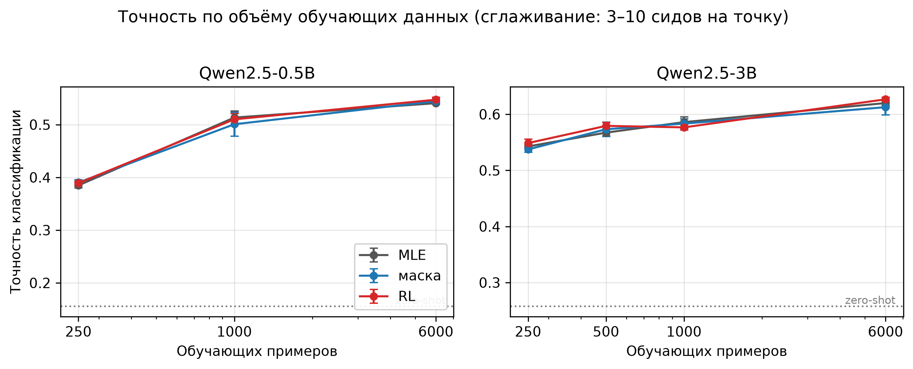

# Контрастное обучение промптов для диалоговых языковых моделей

Репозиторий содержит код и результаты курсовой работы **«Контрастное обучение для автоматизации подбора промптов языковых моделей для диалоговых систем»**.

Исследование проверяет, переносится ли метод CRL-Prompt с классификации текстов на авторегрессионную генерацию диалоговых ответов. В экспериментах используются модели Qwen2.5 размером от 0.5B до 3B и датасет EmpatheticDialogues. Базовая языковая модель остаётся замороженной, обучается только непрерывный префикс.

Финальный текст работы: [docs/zaycev_ma_kontrastnoe-obuchenie-dlya-avtomatizacii-podbora-promptov-yazykovyh-modeley-dlya-dialogovyh-sistem_374180.pdf](docs/zaycev_ma_kontrastnoe-obuchenie-dlya-avtomatizacii-podbora-promptov-yazykovyh-modeley-dlya-dialogovyh-sistem_374180.pdf). Полная хронология экспериментов и исправлений сохранена в [docs/EXPERIMENT_LOG.md](docs/EXPERIMENT_LOG.md). Краткое описание этапов находится в [docs/EXPERIMENTS.md](docs/EXPERIMENTS.md).

## Основной результат

На Qwen2.5-3B дополнительные компоненты CRL-Prompt не дали устойчивого среднего улучшения относительно обучения префикса по кросс-энтропии. Этот результат сохраняется в двух постановках:

1. классификация эмоций по ситуации;
2. одноходовая генерация эмпатичного ответа по известной эмоции и ситуации.

Ранние положительные изменения для Qwen2.5-0.5B и малой обучающей выборки исчезли после расширения серии независимых запусков. Поэтому итоговый вывод основан на полной серии, а не на промежуточных удачных конфигурациях.

### Классификация эмоций

Qwen2.5-3B, 32 класса, среднее и стандартное отклонение по независимым запускам.

| Конфигурация | Accuracy, тест 500 | Accuracy, полный тест 2542 |
|---|---:|---:|
| Zero-shot | 0.258 | - |
| MLE | 0.618 ± 0.010 | 0.624 ± 0.005 |
| Контраст, маска префикса | 0.628 ± 0.008 | 0.623 ± 0.006 |
| Контраст, путаемая метка | 0.569 ± 0.111 | 0.569 ± 0.118 |
| CE + REINFORCE | 0.626 ± 0.006 | 0.625 ± 0.007 |
| Контраст + REINFORCE | 0.619 ± 0.012 | 0.623 ± 0.010 |

Дообучение префикса заметно улучшает zero-shot результат. При этом контрастный и RL-компоненты не дают воспроизводимого выигрыша над MLE.

### Генерация ответов

Qwen2.5-3B, среднее и стандартное отклонение по независимым запускам.

| Конфигурация | ROUGE-L, тест 500 | ROUGE-L, тест 1000 | Multi-reference ROUGE-L | BERTScore |
|---|---:|---:|---:|---:|
| MLE | 0.179 ± 0.004 | 0.167 ± 0.003 | 0.223 ± 0.006 | 0.283 ± 0.003 |
| Маска префикса | 0.175 ± 0.016 | 0.163 ± 0.015 | 0.221 ± 0.016 | 0.291 ± 0.008 |
| Неуместный ответ | 0.178 ± 0.005 | 0.166 ± 0.004 | 0.223 ± 0.006 | 0.282 ± 0.003 |
| Переставленный ответ | 0.172 ± 0.018 | 0.160 ± 0.016 | 0.217 ± 0.016 | 0.250 ± 0.065 |
| CE + REINFORCE | 0.179 ± 0.005 | 0.167 ± 0.003 | 0.223 ± 0.005 | 0.281 ± 0.007 |
| GRPO | 0.177 ± 0.009 | - | 0.222 ± 0.006 | - |

Zero-shot ROUGE-L равен 0.081. MLE повышает его до 0.179, но контрастные конструкции и два варианта RL не улучшают базовое дообучение. Для переставленных ответов наблюдается повышенная вариативность и снижение BERTScore.



### Размер модели и объём данных

| Модель | Zero-shot | MLE | Маска минус MLE | RL минус MLE |
|---|---:|---:|---:|---:|
| Qwen2.5-0.5B | 0.156 | 0.540 ± 0.005 | +0.004 ± 0.011 | +0.007 ± 0.011 |
| Qwen2.5-1.5B | 0.184 | 0.584 ± 0.008 | -0.004 ± 0.021 | -0.003 ± 0.013 |
| Qwen2.5-3B | 0.258 | 0.620 ± 0.007 | -0.007 ± 0.019 | +0.007 ± 0.008 |

Качество базовой модели и MLE-префикса растёт с размером модели. Однозначной зависимости эффекта контрастного критерия или RL от размера модели в проведённой серии не обнаружено.





## Метод

Исходный CRL-Prompt объединяет три компонента:

\[
L = L_{CE} + \beta L_{ctr} + \gamma L_{RL}.
\]

- `L_CE` обучает префикс предсказывать целевую последовательность.
- `L_ctr` отталкивает представление правильной последовательности от представлений негативов.
- `L_RL` оценивает возмущённый префикс по задачной награде и формирует REINFORCE-обновление.

В этой работе P-Tuning v2 заменён на prefix tuning с MLP-проекцией. Для Qwen2.5-3B обучается около 4.81 млн параметров, примерно 0.156% модели. Контрастный и RL-компоненты включаются с начала четырёхэпохного обучения.

### Задачи

**Классификация эмоций**

```text
Situation: I lost my wallet.
Emotion:
```

Модель генерирует одну из 32 меток EmpatheticDialogues. Дополнительно поддерживается вербализатор по первым токенам меток.

**Генерация ответа**

```text
Emotion: anxious
Situation: I lost my wallet.
Response:
```

Целью служит первая реплика другого участника диалога. Во время оценки эталонный ответ полностью удаляется из входа.

### Негативные примеры

- `mask`: маскирование 10% embedding-слоя префикса;
- `wrong_label`: близкая, но неправильная эмоция;
- `offtopic`: ответ из другого диалога;
- `offtopic4`: четыре ответа из других диалогов;
- `incoherent`: перестановка предложений или слов эталонного ответа.

Негативная ветвь по умолчанию вычисляется без градиента, как в проведённой серии. Для отдельной абляции предусмотрен режим `negative_branch_gradient: true`.

## Структура репозитория

```text
.
├── main.py                         # единая точка запуска
├── configs/                        # YAML-конфигурации экспериментов
├── src/crl_prompt/
│   ├── config.py                   # типизированная конфигурация
│   ├── data.py                     # EmpatheticDialogues и негативы
│   ├── modeling.py                 # Qwen2.5 + prefix tuning
│   ├── trainer.py                  # CE, contrast, REINFORCE, GRPO
│   ├── evaluation.py               # чистая генерация и вербализатор
│   ├── metrics.py                  # accuracy, ROUGE, BERTScore, Distinct
│   ├── experiments.py              # парные и resume-safe запуски
│   └── reporting.py                # таблицы и графики
├── experiments/                    # отдельные сценарии групп экспериментов
├── notebooks/                      # исходные рабочие ноутбуки с выводами
│   ├── main_experiments.ipynb
│   ├── capacity_and_low_data.ipynb
│   ├── large_test_evaluation.ipynb
│   ├── grpo_response_generation.ipynb
│   └── paper_figures_and_zero_shot.ipynb
├── results/
│   ├── paper_results.json          # значения итоговых таблиц
│   └── raw/                        # агрегаты завершённых запусков
├── figures/                        # рисунки статьи
├── docs/
│   ├── zaycev_ma_..._374180.pdf    # итоговая работа
│   ├── EXPERIMENT_LOG.md           # полный журнал
│   ├── EXPERIMENTS.md              # краткая хронология
│   └── REPRODUCIBILITY.md          # детали воспроизведения
└── tests/                          # быстрые тесты подготовки данных и метрик
```

В репозитории нет весов базовых моделей, кэша Hugging Face и обученных адаптеров. Они создаются в `outputs/`, который исключён из Git. Сохранённые JSON-файлы достаточны для проверки опубликованных агрегатов и построения рисунков.

## Рабочие ноутбуки

Каталог `notebooks/` содержит исходные файлы, в которых проводились эксперименты. Они сохранены вместе с имеющимися выводами и нужны для аудита истории исследования. Абсолютные пути локального виртуального окружения в выводах заменены на `<VENV>`; код и численные результаты не изменены. Для повторного запуска рекомендуется использовать модульный Python-код и `main.py`.

| Ноутбук | Содержание |
|---|---|
| `main_experiments.ipynb` | классификация эмоций, генерация ответов, контрастные варианты и REINFORCE |
| `capacity_and_low_data.ipynb` | развертка по размеру модели и объёму данных, независимые репликации, prefix drift |
| `large_test_evaluation.ipynb` | переоценка адаптеров на увеличенных тестовых выборках |
| `grpo_response_generation.ipynb` | токенно-уровневая GRPO-оптимизация генерации |
| `paper_figures_and_zero_shot.ipynb` | zero-shot лестница моделей и подготовка рисунков статьи |

## Установка

Рекомендуемое окружение: Linux, Python 3.11, CUDA-совместимая видеокарта. Основные эксперименты проводились в `bf16`; для Qwen2.5-3B требуется около 16 ГБ видеопамяти при указанном батче.

```bash
python3.11 -m venv .venv
source .venv/bin/activate
python -m pip install --upgrade pip
pip install -r requirements.txt
pip install -e .
```

CUDA-сборку PyTorch при необходимости следует установить по инструкции для используемой версии драйвера до выполнения `pip install -r requirements.txt`.

## Воспроизведение

Показать итоговые числа без обучения:

```bash
python main.py summary
```

Перестроить рисунки из сохранённых агрегатов:

```bash
python main.py figures
```

Запустить основные эксперименты:

```bash
python main.py classification
python main.py generation
python main.py grpo
python main.py capacity
python main.py ablations
python main.py zero-shot
python main.py large-eval
```

Полный последовательный запуск:

```bash
python main.py all
```

Это вычислительно дорогая команда. Она включает несколько моделей, размеров выборки и независимых запусков. Для проверки пайплайна лучше начать с одного запуска:

```bash
python main.py classification --seeds 42
```

Все сценарии являются resume-safe. Если `results.json` и общий старт уже существуют, завершённый запуск пропускается. Флаг `--force` принудительно запускает обучение заново.

Переоценка одного сохранённого адаптера на увеличенном тесте:

```bash
python scripts/evaluate_adapter.py \
  --config configs/generation_mle.yaml \
  --checkpoint outputs/generation/seed_42/mle/best_prefix.pt \
  --test-size 1000 \
  --bertscore \
  --multi-reference \
  --output outputs/evaluation/generation_mle_seed42.json
```

Zero-shot оценка выполняется без prefix tuning:

```bash
python scripts/zero_shot.py \
  --config configs/classification_mle.yaml \
  --output outputs/zero_shot_3b.json
```

Диагностика изменения параметров префикса:

```bash
python scripts/prefix_drift.py \
  --start outputs/classification/seed_42/shared_start.pt \
  --trained outputs/classification/seed_42/mle/best_prefix.pt
```

Те же группы доступны отдельными файлами:

```bash
python experiments/classification/run.py --seeds 42
python experiments/response_generation/run.py --seeds 42
python experiments/capacity_sweep/run.py --seeds 42
python experiments/grpo/run.py --seeds 42
python experiments/ablations/run.py --seeds 42
```

## Важные детали воспроизводимости

1. Сравниваемые конфигурации внутри одного запуска получают одинаковый старт префикса.
2. В основной серии общий старт выбирается из четырёх кандидатов по validation CE после 200 probe-шагов.
3. В развертке по размеру модели и выборки используется общий случайный старт без probe-отбора.
4. Валидационная метрика вычисляется на чистом входе. Целевые токены не передаются в `generate()`.
5. Лучшая эпоха выбирается по accuracy для классификации и ROUGE-L для генерации.
6. Классификационные цели не содержат EOS; генеративные цели содержат EOS.
7. Для совместимости с завершёнными сериями обучающий collator сохраняет историческую схему padding `0/0`. Она включена параметром `legacy_training_padding`.
8. Подвыборки детерминированы и берутся как первые `N` эпизодов после дедупликации по `conv_id`.

Подробнее: [docs/REPRODUCIBILITY.md](docs/REPRODUCIBILITY.md).

## Проверка кода

```bash
pytest
python -m compileall src main.py experiments
```

Тесты не загружают модели и проверяют детерминированные преобразования данных, построение негативов и базовые метрики.

## Ограничения

- Исследование проведено на EmpatheticDialogues и одном семействе Qwen2.5.
- Генерация одноходовая и использует известную эмоцию как условие.
- ROUGE-L и BERTScore не заменяют человеческую оценку релевантности, эмпатии и связности.
- При четырёх эпохах увеличение обучающей выборки одновременно увеличивает число шагов оптимизатора.
- Prefix tuning с проекцией является адаптацией исходного P-Tuning v2, а не точным повторением его параметризации.

## Ссылки

1. Lapokin D., Savchenko A. *CRL-Prompt: Contrastive Reinforcement Learning for Soft Prompt Tuning*. ACL SRW, 2026.
2. Liu X. et al. *P-Tuning v2: Prompt Tuning Can Be Comparable to Fine-tuning Universally Across Scales and Tasks*. ACL, 2022.
3. Li X. L., Liang P. *Prefix-Tuning: Optimizing Continuous Prompts for Generation*. ACL, 2021.
4. Rashkin H. et al. *Towards Empathetic Open-Domain Conversation Models: A New Benchmark and Dataset*. ACL, 2019.
